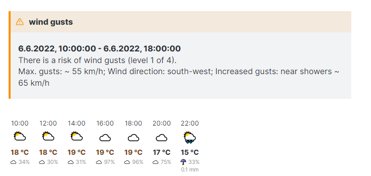
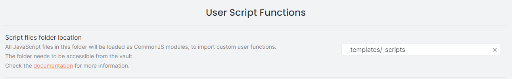
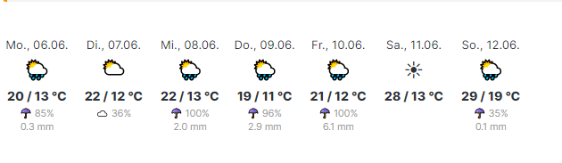
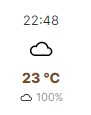
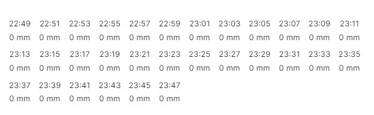

# Script to receive and render weather information from openweathermap.org

## Prerequisites

- Community Plugin Templater
- An Account and API Key from <https://openweathermap.org>

### Other ways of using the script

The script itself does **not** depend on templater. It outputs an string in html syntax and should be useable in other ways (i.e. CustomJS). This guide, however, is focused on the use with Templater.

## Usage

1. If you havent already, specify a "Script files folder location" for Templater ([Doc](https://silentvoid13.github.io/Templater/user-functions/script-user-functions.html))
2. Read through the .js file to make sure I don't want to steal your sensitive data :) Jokes aside: Never run code you don't understand!
3. Copy the .js file into your script files folder for Templater
4. Edit the script. At the top you'll find a bunch of variables that let you configure the script. You need to **at least** add your API Key as well as your lat/lon values at the very top (also see "Find lat/lon for your location")
5. Add `<% tp.user.weather() %>` to the template you want to use the script
 1. That'll give you the hourly weather like configured in the script and is feasable for daily notes
 2. You can customize the output independent from the script defaults, see "Call parameters"
6. Add weather.css to your [css snippet folder](https://help.obsidian.md/How+to/Add+custom+styles) and tweak it to your liking

### Find lat/lon for your location

1. Go to <https://www.openstreetmap.org>
2. Search for your location
3. When you have it, click on "Share" on the right side
4. You'll see a GEO-URI that looks like `geo:46.0752,18.2060?z=14`
5. The first geo value (46.0752) is your lat, the second (18.2060) your lon.

### Call Parameters

When calling `<% tp.user.weather() %>`, you'll get the hourly forecast like configured in the script. However, to use the script in different scenarios - i.e. getting hourly forecast for the dailys and daily forecasts for your weekly notes - you can insert up to three parameters into the function call:

`<% tp.user.weather(forecastType, forecastCount, forecastGap) %>`
for example: `<% tp.user.weather('daily', 7, 1) %>`

`forecastType` defines which type of forecast you want to get. Available are [the following values](https://openweathermap.org/api/one-call-3#how):

- `current` - gets you the current weather
- `minutely` - gets you a minutely forecast of expected precipitation
- `hourly` - gets you hourly forecasts for the next 48 hours
- `daily` - gets you daily forcasts for the next 8 days (and today)
- `alerts` - gets you weather alerts. Please note that you always get these, by passing `alerts` to the function you **only** get alerts.

Defaults to `hourly.`

`forecastCount` is a number and lets you determine how many forecasts you want to get. The maximum is depending on your `forecastType`:

- `current` - exactly 1
- `minutely` - max. 60
- `hourly` - max. 48
- `daily` - max. 8
- `alerts` - _does not apply_

`forecastGap` is a number and lets you decide if you want every available forecast (up to your `forecastCount`) or i.e. every second or third hourly forecast to cover a larger timespan. Please note: `forecastCount * forecastGap` needs to be smaller or equal to the maximum dataset, otherwise you'll get as many forecasts as possible with the given `forecastGap`.

## Limitations

- You need an internet connection to retreive the information
- **Templater user scripts do not work on mobile right now**. Even worse, it will keep your template from rendering at all. Please see  [Issue 586 on the Templater repository](https://github.com/SilentVoid13/Templater/issues/586)
- It'll retreive the forecast from your moment of sending the request, not from beginning of the day. This is a limitation of the (free) API.
- <https://openweathermap.org> has a limitation of monthly API calls and the script is not caching your result. The limitation is at 1000 calls per month (so around 30 calls a day), so it shouldn't pose an issue if you don't use it in some automated, wasteful way. If you do so, I recommend implementing a cache to avoid requesting the same data again

## Screenshots

`<% tp.user.weather() %>` (hourly)

`<% tp.user.weather('daily', 7, 1) %>`

`<% tp.user.weather('current') %>`

`<% tp.user.weather('minutely') %>`

_Disclaimer: I know that the minutely forecast output is not super helpful - I think if you want to use this information, it's better to build a script that outputs data useable in a diagram_